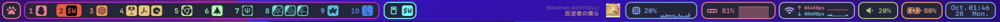

# sketchybar-app-font-bg 🍹

 ⚠️ This repository is based on [sketchybar-app-font](https://github.com/kvndrsslr/sketchybar-app-font) and [simple-bar](https://github.com/Jean-Tinland/simple-bar)'s minimal app icons

## ✨ Features

See Preview: [Icon Preview ⚛️](https://soichiroyamane.github.io/sketchybar-app-font-bg/)

- **Simple drawings**
- **Consistent style**
- **Based on icons from apple's icns**

### 🍹 Example in Sketchybar

Left bar: show the open apps with the icons from this font.

Dotfiles are released here: [SoichiroYamane/dotfiles](https://github.com/SoichiroYamane/dotfiles)

## 🚀 CLI Usage

```bash
# install dependencies
pnpm install

# - build the files
# - install the font to: $HOME/Library/Fonts/sketchybar-app-font-bg.ttf
# - install the icon map script to: $HOME/.config/sketchybar/helpers/icon_map.lua
pnpm run build:install 

# same as build:install but watches changes to files in ./svgs and ./mappings and refires
pnpm run build:dev
```

## ⚙️ Configure Sketchybar

### 🌕 Using [SbarLua](https://github.com/FelixKratz/SbarLua)

1. Run `pnpm run build:install` to install the font and the icon map script. `icon_map.lua` will be created in `~/.config/sketchybar/helpers/`.
2. Require the `icon_map.lua` in your configuration file.

    Example:

    ```lua
    local app_icons = require("helpers.icon_map")

    local chatgpt = sbar.add("item", {
    label = {
      string = app_icons["ChatGPT"],
      font = "sketchybar-app-font-bg:Regular:18.0",
    },
    })
    ```

## 💻 Contribution Guideline

Contributions are welcome!

*(Core method copied from <https://github.com/Jean-Tinland/simple-bar/issues/164#issuecomment-896912216>)*

I am using the following process to add new icons:

1. Export icon image from the installed app

   1. Open the Application folder in Finder
   2. Right-click on the app and select "Get info"
   3. Click on the icon and press `Cmd + C`
   4. Open Preview and press `Cmd + N` to create a new image from the clipboard
2. Redrawing the icon in design software. I'm using Affinity Designer 2, but any tool that can export SVGs will work.

    1. First, set the document size to `24x24` pixels. The shape of the box icon (background) almost fits in the document size.
    2. Redraw the icon on the image. For icon background, you can use the `assets/template.svg` file.
    3. Export the icon as an SVG file.
3. Optimize the SVG file using [SVGOMG](https://jakearchibald.github.io/svgomg/).
4. Add the icon to the `/svgs/` folder, using a snake_case name surrounded by colons and a `.svg` extension.
5. Add a file to the `/mappings/` folder using the same name but without the `.svg` extension. This file indicates which app names should match the icon. The format is `"App Name 1" | "App Name 2"`.
